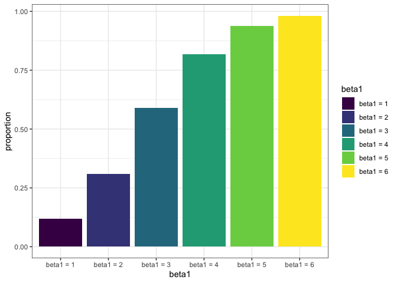
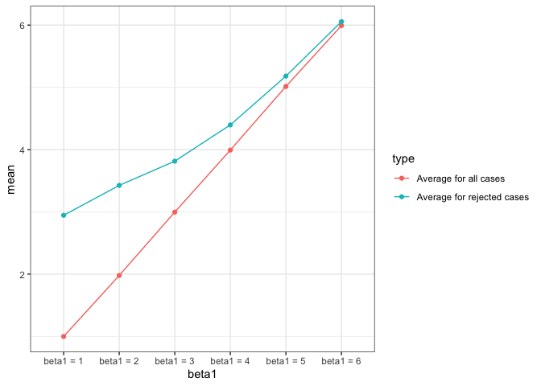

Homework 5
================
Mengyu Zhang
11/1/2019

# Problem 1

Write a function that takes a vector as an argument; replaces missing
values using the rules defined above; and returns the resulting vector.
Apply this function to the columns of `iris_with_missing` using a `map`
statement.

``` r
#get data
set.seed(10)

iris_with_missing = iris %>% 
  map_df(~replace(.x, sample(1:150, 20), NA)) %>%
  mutate(Species = as.character(Species))
```

``` r
# function
replace = function(x) {
  
  if(is.numeric(x)) {
    x = ifelse(is.na(x), mean(x, na.rm = TRUE), x)
  }
  else {
    x = ifelse(is.na(x), "virginica", x)
  }
  x
}
# map_df
replace_value_df= map_df(iris_with_missing, replace)
# map
replace_value_list = map(iris_with_missing, replace)
```

# Problem 2

### Create the Dataframe

``` r
#get data
path = "data/"
file_name = list.files('./data')
vec_path = str_c(path, file_name)
df = map_df(vec_path, read_csv)
df = cbind(tibble(file_name), df)
```

### Tidy the Data

``` r
#tidy data
df_participant = df %>%
  separate(file_name, into = c("arm", "id"), sep = "\\_") %>% 
  mutate(id = str_replace(id, ".csv$", ""),
         id = factor(id),
         arm = factor(arm)) %>% 
  pivot_longer(
    week_1:week_8,
    names_to = "week",
    names_prefix = "week_",
    values_to = "observations")
```

### Spaghetti Plot

``` r
df_participant %>% 
  ggplot(aes(x = week, y = observations, group = id)) + 
  geom_line(aes(color = id)) + 
  scale_color_viridis(discrete=TRUE) + 
  facet_grid(~arm) + 
  theme_bw()
```

<!-- -->

**Comment: **There is an increasing trend in values of observations over
time in experimental arm, while in control arm, there is no abvious
change over time.

# Problem 3

``` r
#function
sim_regression = function(n = 30, beta0 = 2, beta1) {
  
  sim_data = tibble(
    x = rnorm(n, mean = 0, sd = 1),
    y = beta0 + beta1 * x + rnorm(n, 0, 50)
  )
  
  ls_fit = lm(y ~ x, data = sim_data)
  tidy = broom::tidy(ls_fit, conf.level = 0.95)
  
  tibble(
    beta1_hat = pull(tidy, estimate)[2],
    p_value = pull(tidy, p.value)[2]
  )
}
```

``` r
# simulation
sim_results = 
  tibble(beta1 = c(0:6)) %>% 
  mutate(
    output_list = map(.x = beta1, ~rerun(10000, sim_regression(beta1 = .x))),
    output_df = map(output_list, bind_rows)) %>% 
  select(-output_list) %>% 
  unnest(output_df)
```

``` r
# association between effect size and power
sim_results %>% 
  mutate(p_value_ind = case_when(
    p_value < 0.05 ~ 1,
    p_value >= 0.05 ~ 0)) %>%   
  group_by(beta1) %>% 
  summarise(
    proportion = sum(p_value_ind)/n()) %>% 
  mutate(
    beta1 = str_c("beta1 = ", beta1),
    beta1 = fct_inorder(beta1)) %>% 
  ggplot(aes(x = beta1, y = proportion, fill = beta1)) + 
  geom_bar(stat = "identity") +
  scale_fill_viridis(discrete=TRUE) +
  theme_bw()
```

<!-- -->

``` r
# the average estimate of β̂ 1 on the y axis and the true value of β1 on the x axis
sim_plot1 = sim_results %>% 
  group_by(beta1) %>% 
  summarise(
    mean = mean(beta1_hat)) %>% 
  mutate(
    beta1 = str_c("beta1 = ", beta1),
    beta1 = fct_inorder(beta1))

# the average estimate of β̂ 1 only in samples for which the null was rejected on the y axis and the true value of β1 on the x axis
sim_plot2 = sim_results %>% 
  mutate(p_value_ind = case_when(
    p_value < 0.05 ~ 1,
    p_value >= 0.05 ~ 0)) %>%
  filter(p_value_ind == 1) %>% 
  group_by(beta1) %>% 
  summarise(
    mean = mean(beta1_hat)) %>% 
  mutate(
    beta1 = str_c("beta1 = ", beta1),
    beta1 = fct_inorder(beta1))

df_plot = 
  sim_plot1 %>%
  mutate(type = 'Average for all cases') %>%
  bind_rows(
    sim_plot2 %>%
      mutate(type = 'Average for rejected cases'))


ggplot(df_plot, aes(x = beta1, y = mean, group = type, color = type)) + 
  geom_point() +
  geom_line() +
  theme_bw()
```

<!-- -->
